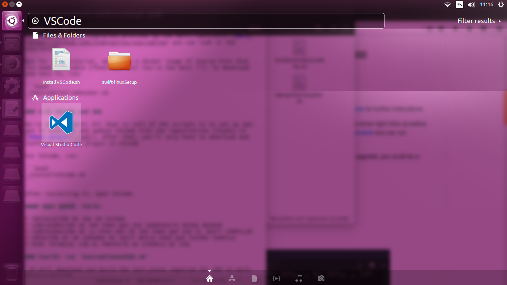
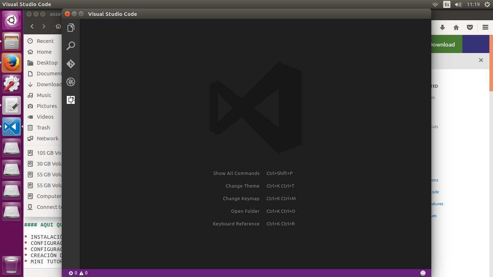
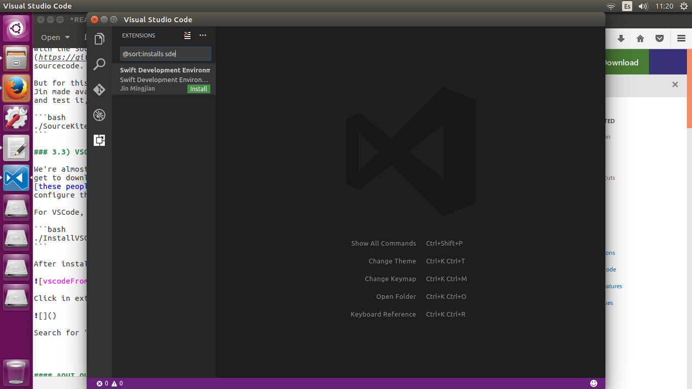
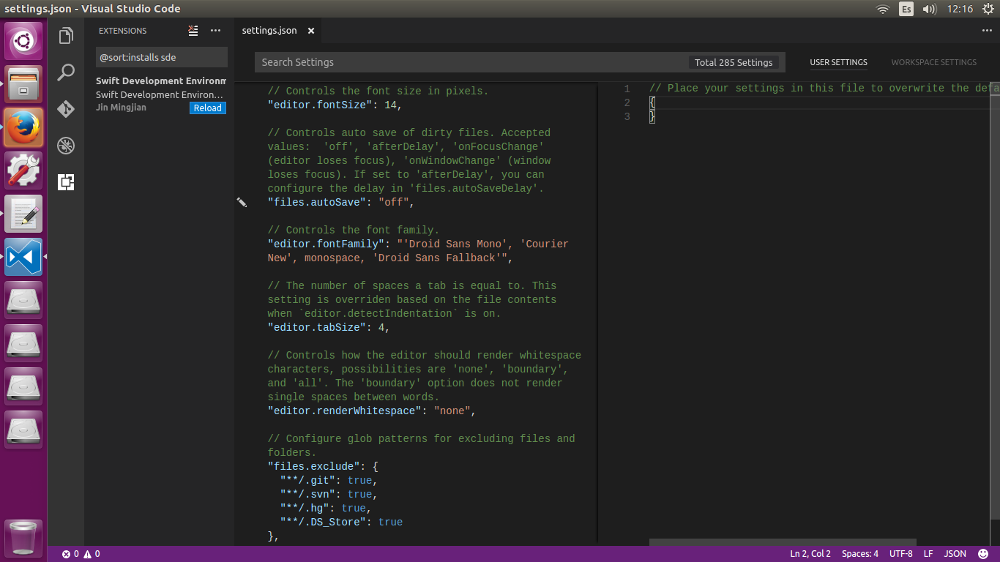

# Swift@Linux Setup
_Shell Scripts and instructions on how to set up Swift on Linux._

**TODO: proofreading.**

Follow the Steps:

## 0) Pre-requisites 

These scripts are intended for use in Ubuntu 16.04. If you're **not running 16.04 or a derivative, you've been warned.**

Apart from running Ubuntu 16.04, you'll need `git`. Open your Terminal (`Ctrl + Alt + T`) and run:

```bash

sudo apt-get install git

```

And after that, clone this repo:

```bash

git clone https://github.com/felix91gr/swift-linuxSetup.git

```

With that, you're ready to start with the *real setup.*

## 1) Basic dependencies

You'll need certain **dependencies** to install the Swift Toolchain. To have them, run the `BasicSwiftDependencies.sh` script and that's it:

```bash

./BasicSwiftDependencies.sh

```

## 2) Install the toolchain

You can compile the toolchain if you want to. But since we'll need Swift 3.1, which is still in development, is hard to reliably compile it. **Instead,** we're gonna use the precompiled 3.1 toolchain, available at [swift.org](swift.org).

For that, run the next script:

```bash

./S_3.1_Toolchain.sh

```
Now you should be able to use the `Swift REPL` (interactive Swift terminal). Test it, closing the current terminal, then opening a new one and running:

```bash

swift

```

You should see the following prompt:

```console
Welcome to Swift version 3.1-dev (LLVM 04d780b9be, Clang 5fd2455004, Swift ccffbcd31a). Type :help for assistance.
  1>
```
If you wanna know how and why to use the REPL, go [here](https://swift.org/lldb/#why-combine-the-repl-and-debugger). To exit the REPL, press `Ctrl + D`.

If all went well, **now you're ready to use Swift in Linux!**. If you want to setup the SDE (Swift Development Environment), follow the rest of the tutorial.

## 3) SDE

[SDE](https://github.com/jinmingjian/sde), or Swift Development Environment, is a great plugin for Swift development in Linux using VSCode. It is made and mantained by the awesome [Jin Mingjian](https://github.com/jinmingjian). It features:

* Syntax highlighting
* Autocomplete
* Error checking and highlighting

*Note: For now, I can only provide the "Docker-based" steps. Sorry about that, when I manage to reliably have a "native" install of SDE, I will post it here. Given that Swift 3.1 is around the corner, it should be getting easier to make it work the native way.* 

Anyway. **Onwards!**.

### 3.1) Docker

You'll need **Docker** for this. Docker is a lightweight virtualization tool, which allows us to have a linux VM with high performance and low memory and CPU footprint. We'll use it to have a *Docker Container* which will run **Source Kite**, the backend of SDE.

But first, we'll have to install and configure Docker. For that, run:

```bash

./DockerSetup.sh

```
If it worked, you should see the output of the `hello-world` docker command. If it did work, you should now log out and log back in to manifest the changes in your user privileges. 

*Basically, you won't need the __sudo__ keyword to use docker commands*

### 3.2) Source Kite

**Source Kite** is the backend for SDE. It allows SDE to interface with the SourceKit libraries provided by the Swift toolchain. [Here](https://github.com/jinmingjian/sourcekite) you can look at the sourcecode.

But for this tutorial, we'll use a [docker image of Source Kite](https://hub.docker.com/r/jinmingjian/docker-sourcekite/) that Jin made available (Thank you Jin! You're the best ^o^). To download and test it, run:

```bash
./SourceKiteFromDocker.sh
```

### 3.3) Install VSCode and SDE

We're almost there! All that is left of the scripts is to set up `apt-get` to **download and update VSCode** from the repositories (thanks to [these people](https://github.com/Microsoft/vscode/issues/2973) for making it so easy!). After that, you'll only have to download and configure the SDE plugin in VSCode.

For installing VSCode, run:

```bash
./InstallVSCode.sh
```

After installing it, open it:



Click in extensions:



Search for "sde" and install it:



Then, click **Reload** to reload the current window and activate SDE.

That's it! Now all that is left is to configure SDE for our setup, and **you'll have a working Swift IDE!**

## 4) Configuration of SDE

We have to tell SDE two things:

* That we are using Source Kite from Docker
* Where is the swift compiler binary located

To do so, in VSCode go to: `File` => `Preferences` => `Settings`. This will open up an empty `JSON` file:



Inside the brackets, insert the following: *(replace as needed for your folders)*

```json
    "swift.path.sourcekiteDockerMode":true,
    "swift.path.swift_driver_bin":"/home/felix/swift-linuxSetup/swift-binaries/usr/bin/swift"
```

After that, save it (`Ctrl + S`) and close it.

## Now test it!

Try SDE! You can use your own project, or the [example project](https://github.com/jinmingjian/sde-demos) provided by Jin for SDE.

* Open the folder in VSCode: File => Open Folder

* Open one of the sources and make an edit. Save it.

* Start a build process (Alt + B). It may take a while.

* After the first build, SDE will understand your project well. Type and enjoy!


# Afterwords

## More details on how to start with SDE

[Go here!](http://blog.dirac.io/2017/01/11/get_started_sde.html)

## Future native setup?

I would love to provide a native (non-dockery) setup, but as of right now *(March the 2nd, 2017)* I haven't been able to reliably get SourceKit binaries, which are needed for the fully native setup. If you can provide some help, feel free to put up an Issue; I'm all ears!

## Credits and sources

Many, many credits go to the work of the **awesome Jin Mingjian**. I am but a novice who knows how to use google properly :P

He helped me substantially trying to debug my attempts at compiling and linking the libraries of the Swift 3.1 toolchain. He also explained me many concepts and properties of it, and of his own projects. Thank you very much Jin!

While we're at it: I used the work from his [SDE](https://github.com/jinmingjian/sde) and [Source Kite](https://github.com/jinmingjian/sourcekite) projects, and his [demos](https://github.com/jinmingjian/sde-demos).

Much love to the **Swift Team** and to the **Swift community**, at [swift.org](https://swift.org/) and at [the Swift repository](https://github.com/apple/swift), because they make Swift possible :heart:

Thanks to the [Docker](https://www.docker.com/) people, who made this special setup possible.

And lastly, thanks to the VSCode community for [providing a secure apt-get repository](https://github.com/Microsoft/vscode/issues/2973) for easy installation and update of it on Debian-based systems.

I made the scripts, and I give them to the public domain. **Use them as you wish.**
